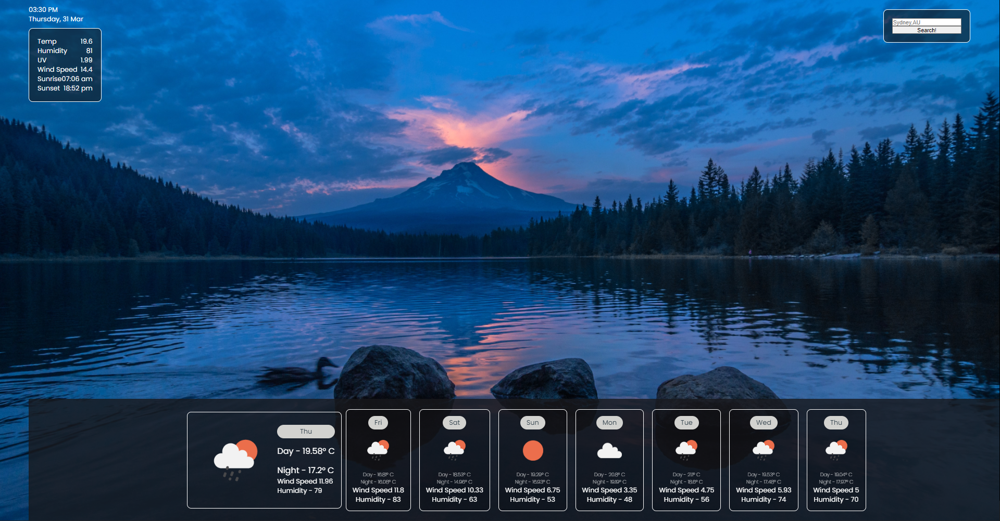

# Weather-Forecaster

## The Project

This project was designed to allow users to see a quick weekly forecast of a city for the current week. By using a city name and two letter country code, users are able to have various items populate into weekly forecast fields with relevant information for each day of the week.

## Usage

The project will immediately ask to use your current location, upon acceptance the various fields will populate to give you a weather forecast for your current area! Declining the current location prompt still allows users to search, but fields will simply have placeholder values until the search is completed.

## Credits

Image for background taken from unsplash.com.

Weather API used from [Open Weather App](https://home.openweathermap.org/)

## License

[MIT](https://choosealicense.com/licenses/mit/)

## Features

**Weather forecast for any city in the world using a city name and country code.**
**Sleek and beautiful design using a background image from unsplash.**
**Scrolling feature for use with mobile devices and laptops for bottom forecast fields.**
**Dynamically populating fields, inputs can be altered within the code to select which fields are most important for users.**
